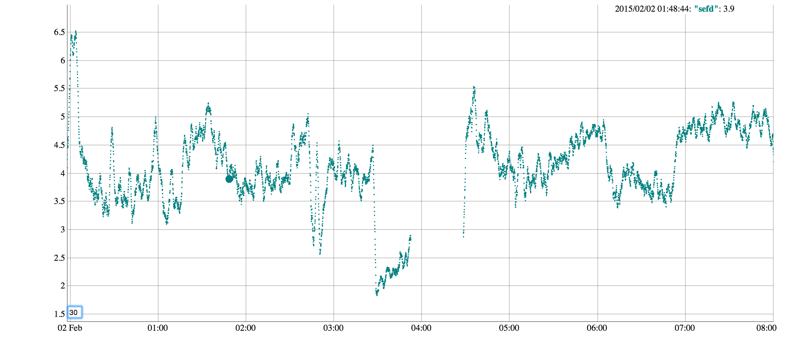

NeuroSky Experiments
====================

Analyze sleep using "NeuroSky Thinkgear" EEG sensor.


Device
------

I was using the "MindCap XL" ([MindTec](http://www.mindtecstore.com/en/mindcap-xl), [Amazon](http://www.amazon.de/MindCap-XL/dp/B00H8NQ75Y))
which measures a single EEG signal with NeuroSky's [TGAM EEG sensor](http://store.neurosky.com/products/eeg-tgam),
and sends data over Bluetooth.


### Thinkgear Connector
On OSX Download and install: http://developer.neurosky.com/docs/doku.php?id=thinkgear_connector_tgc

Start `ThinkGearConnector.app`. It might be easier to run the binary from a terminal, to see the debug output regarding the Bluetooth connection:
```
/Applications/ThinkGearConnector.app/Contents/MacOS/ThinkGearConnector
```


Library Code
------------
Files in [`lib/`](lib/).

### ThinkgearClient
Client for the *Thinkgear Connector* server.
Emits data as specified by the [TGSP protocol](http://developer.neurosky.com/docs/lib/exe/fetch.php?media=thinkgear_socket_protocol.pdf).

```js
ThinkgearClient.createClient({appName: 'record'}, function(thinkgear) {
  thinkgear.on('data', function(data) {
    console.log(data);
  });
});
```

### Streams

Most files implement a NodeJS [Stream](https://nodejs.org/api/stream.html).
All streams operate on objects of type `Sample`.

Readable streams:
- thinkgear/reader: Read EEG values from *ThinkGear Connector*
- mongodb/reader: Reads samples from the given collection
- fft/sine: Generates a sine wave (for testing)

Writable streams:
- mongodb/writer: Writes samples to the given collection
- stream/printer: Prints to STDOUT

Transform streams:
- fft/sampler: Reads samples' `rawEeg` value and transforms to samples with `spectrum` (type `Spectrum`)
- stream/average: Moving average of numerical samples over a specified time duration
- sleep/bands: Calculate relative magnitude of certain frequency bands from spectrum
- sleep/sef: Calculate SEF50 and SEF95 from spectrum (see [A Low Computational Cost Algorithm for REM Sleep Detection Using Single Channel EEG](http://www.ncbi.nlm.nih.gov/pmc/articles/PMC4204008/))


Examples
--------
Files in [`bin/`](bin/).

### record.js
Read samples and store them inin a MongoDB collection

### plotRaw.js
Load raw samples from MongoDB and plot them in a web page:


### plot.js
Load raw samples from MongoDB, run an FFT frequency analysis, and plot the frequency bands:


### sef.js
Load raw samples from MongoDB, run the algorithm from [*A Low Computational Cost Algorithm for REM Sleep Detection Using Single Channel EEG*](http://www.ncbi.nlm.nih.gov/pmc/articles/PMC4204008/) and plot the "SEFd":


